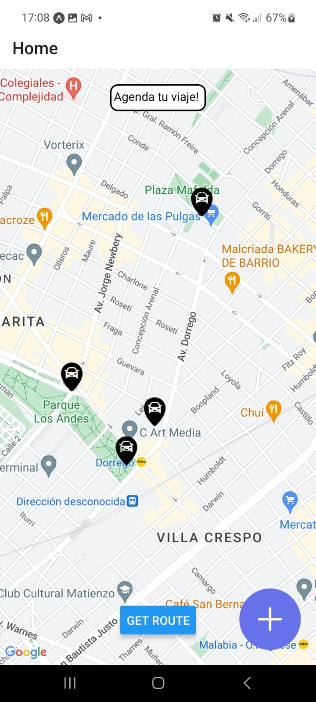
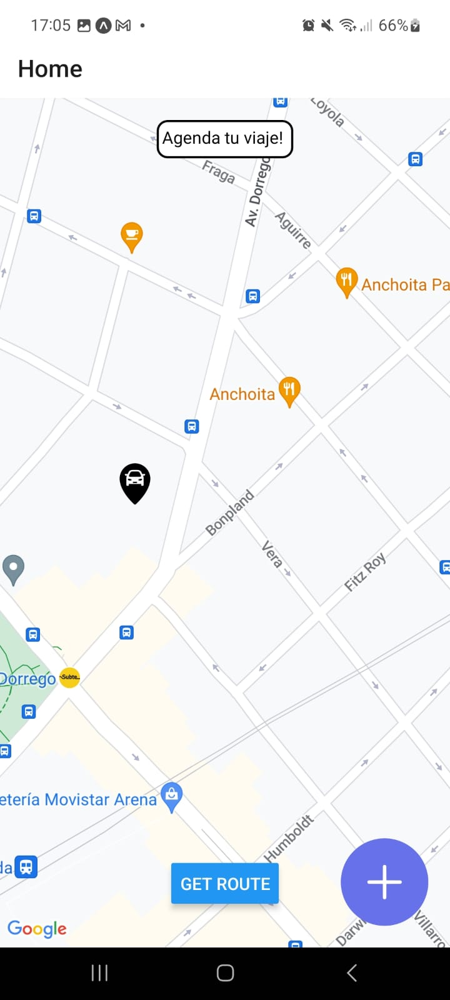
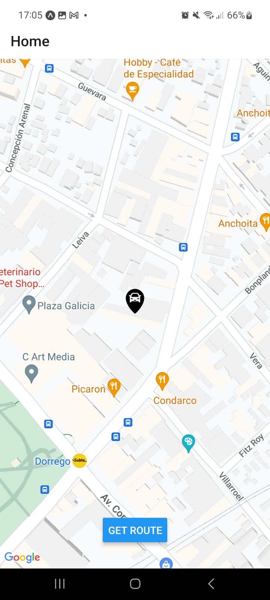
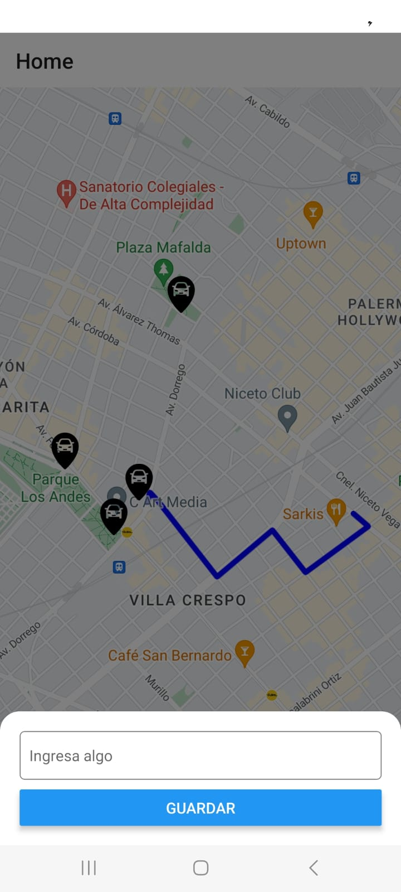

# Nombre del Proyecto

CROSS MOBILE APP

## Acerca del proyecto

Es una aplicación móvil en la cual pretendo incluir funciones como delivery o movilidad del modo taxi. Está aun en proceso de contrucción. Es un proyecto personal con el fin de poner a prueba mis habilidades como desarrollador y tal vez en un futuro poder darle un uso comercial

## Tabla de Contenidos

- [Instalación](#instalación)
- [Uso](#uso)
- [Stack](#stack)
- [Anexos](#anexos)

## Instalación

Proporciona aquí las instrucciones necesarias para instalar y configurar el proyecto. Esto podría incluir:

- clonar el repositorio
- Instalación de dependencias con 'yarn install' o 'npm install'
- Para ejecutar en el movil personal 'yarn start -- --tunnel' o para ejecutar en el emulador de android studio 'yarn android'
- IMPORTANTE: tener un API KEY de google maps con acceso a mapas y routes principalmente. Sustituir los campos API_KEY por la propia.

## Stack

El stack tecnológico utilizado consta de lo siguiente:

- Expo cli
- React Native
- Google Maps
- Ionicons
- Firestore
- Ajax Fetching

## Anexos

Inicio con la ubicación actual

Al mover la ventana aparecen las opciones para agendar un viaje

Al clicar en el boton flotante aparecen las opciones disponibles

Al clicar en 'get route' se dibuja una polylinea (por ahora está hardcodeada)

Modal que emerge desde la parte inferior para ingresar la direccion destino (falta almacenarlo en el estado y agregarlo a la logica del polyline)

